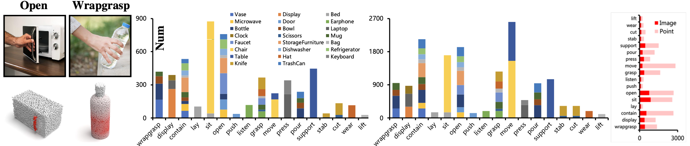
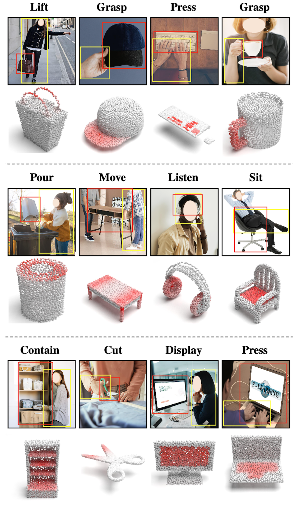

# Grounding 3D Object Affordance from 2D Interactions in Images

PyTorch implementation of Grounding 3D Object Affordance from 2D Interactios in Images. This repository contains PyTorch training and evaluation code, the dataset will coming soon.

## 📋 Table of content
 1. [📎 Paper Link](#1)
 2. [❗ Quick Understanding](#1_)
 3. [💡 Abstract](#2)
 4. [📖 Method](#3)
 5. [📂 Dataset](#4)
 6. [📃 Requirements](#5)
 7. [✏️ Usage](#6)
    1. [Demo](#61)
    2. [Train](#62)
    3. [Evaluate](#63)
    4. [Render](#64)
 8. [🍎 Potential Applications](#8)
 9.  [✉️ Statement](#9)
 10. [🔍 Citation](#10)

## News: Our Paper has been accepted by ICCV2023, we will release the pre-trained model after the camera-ready deadline, and the PIAD dataset will be released after the ICCV2023 conference.

## 📎 Paper Link <a name="1"></a> 
* Grounding 3D Object Affordance from 2D Interactions in Images ([link](https://arxiv.org/pdf/2303.10437.pdf))
> Authors:
> Yuhang Yang, Wei Zhai, Hongchen Luo, Yang Cao, Jiebo Luo, Zheng-Jun Zha

## ❗Quick Understanding <a name="1_"></a> 
The following demonstration gives a brief introduction to our task.
<p align="center">
     <br />
    <em> 
    </em>
</p>

A single image could could be used to infer different 3D object affordance.
<p align="center">
     <br />
    <em> 
    </em>
</p>

Meanwhile, a single point cloud be grounded the same 3D affordance through the same interaction, and different 3D affordances by distinct interactions.
<p align="center">
     <br />
    <em> 
    </em>
</p>

## 💡 Abstract <a name="2"></a> 
Grounding 3D object affordance seeks to locate objects' ''action possibilities'' regions in the 3D space, which serves as a link between perception and operation for embodied agents. Existing studies primarily focus on connecting visual affordances with geometry structures, e.g. relying on annotations to declare interactive regions of interest on the object and establishing a mapping between the regions and affordances. However, the essence of learning object affordance is to understand how to use it, and the manner that detaches interactions is limited in generalization. Normally, humans possess the ability to perceive object affordances in the physical world through demonstration images or videos. Motivated by this, we introduce a novel task setting: grounding 3D object affordance from 2D interactions in images, which faces the challenge of anticipating affordance through interactions of different sources. To address this problem, we devise a novel Interaction-driven 3D Affordance Grounding Network (IAG), which aligns the region feature of objects from different sources and models the interactive contexts for 3D object affordance grounding. Besides, we collect a Point-Image Affordance Dataset (PIAD) to support the proposed task. Comprehensive experiments on PIAD demonstrate the reliability of the proposed task and the superiority of our method. The dataset and code will be made available to the public. 

<p align="center">
     <br />
    <em> 
    </em>
</p>

**Grounding Affordance from Interactions.** We propose to ground 3D object affordance through 2D interactions. Inputting an object point cloud with an interactive image, grounding the corresponding affordance on the 3D object.

## 📖 Method <a name="3"></a> 
### IAG-Net <a name="31"></a> 
<p align="center">
     <br />
    <em> 
    </em>
</p>

**Our Interaction-driven 3D Affordance Grounding Network.** It firstly extracts localized features $F_{i}$, $F_{p}$ respectively, then takes the Joint Region Alignment Module to align them and get the joint feature $F_{j}$. Next, Affordance Revealed Module utilizes $F_{j}$ to reveal affordance $F_{\alpha}$ with $F_{s}$, $F_{e}$ by cross-attention. Eventually, $F_{j}$ and $F_{\alpha}$ are sent to the decoder to obtain the final results $\hat{\phi}$ and $\hat{y}$.

## 📂 Dataset <a name="4"></a> 
<p align="center">
     <br />
    <em> 
    </em>
</p>

**Properties of the PIAD dataset.** **(a)** Data pairs in the PIAD, the red region in point clouds is the affordance annotation. **(b)** Distribution of the image data. The horizontal axis represents the category of affordance, the vertical axis represents quantity, and different colors represent different objects. **(c)** Distribution of the point cloud data. **(d)** The ratio of images and point clouds in each affordance class. It shows that images and point clouds are not fixed one-to-one pairing, they can form multiple pairs.

<p align="center">
     <br />
    <em> 
    </em>
</p>

**Examples of PIAD.** Some paired images and point clouds in PIAD. The ''yellow'' box in the image is the bounding box of the interactive subject, the ''red'' box is the bounding box of the interactive object.

```bash  
We will release our PIAD after the conference.
```


## 📃 Requirements <a name="5"></a> 
  - python-3.9 
  - pytorch-1.13.1
  - torchvision-0.14.1
  - open3d-0.16.0
  - scipy-1.10.0
  - matplotlib-3.6.3
  - numpy-1.24.1
  - OpenEXR-1.3.9
  - scikit-learn-1.2.0
  - mitsuba-3.0.1

## ✏️ Usage <a name="6"></a> 

```bash  
git clone https://github.com/yyvhang/IAGNet.git
```

### Download PIAD <a name="41"></a> 
- We will release the PIAD dataset after the conference.

### Run a Demo <a name="61"></a> 
To inference the results with IAG-Net model, run `inference.py` to get the `.ply` file
```bash  
python inference.py --model_path ckpts/IAG_Seen.pt
```

### Train <a name="62"></a> 
To train the IAG-Net model, you can modify the training parameter in `config/config_seen.yaml` and then run the following command:
```bash  
python train.py --name IAG --yaml config/config_seen.yaml
```

### Evaluate <a name="63"></a> 
To evaluate the trained IAG-Net model, run `evalization.py`:
```bash  
python evalization.py --model_path ckpts/IAG_Seen.pt --yaml config/config_seen.yaml
```

### Render the result <a name="64"></a> 
To render the `.ply` file, we provide the script `rend_point.py`, please read this script carefully. Put all `.ply` file path in one `.txt` file and run this command to get `.xml` files:
```bash  
python rend_point.py
```
Once you get the `.xml` files, just rend them with `mitsuba`, you will get `.exr` results.:
```bash  
mitsuba Chair.xml
```
If your device could not visualize `.exr` file, you can use function `ConvertEXRToJPG` in `rend_point.py` to covert it to `.jpg` file.


## 🍎 Potential Applications <a name="8"></a> 

<p align="center">
     <br />
    <em> 
    </em>
</p>

**Potential Applications of IAG affordance system.** This work has the potential to bridge the gap between perception and operation, serving areas like demonstration learning, robot manipulation, and may be a part of human-assistant agent system e.g. Tesla Bot, Boston Dynamics Atlas.

## ✉️ Statement <a name="9"></a> 
This project is for research purpose only, please contact us for the licence of commercial use. For any other questions please contact [yyuhang@mail.ustc.edu.cn](yyuhang@mail.ustc.edu.cn).

## 🔍 Citation <a name="10"></a> 

```
@inproceedings{Yang2023Affordance,
  title={Grounding 3D Object Affordance from 2D Interactions in Images},
  author={Yang, Yuhang and Zhai, Wei and Luo, Hongchen and Cao, Yang and Luo Jiebo and Zha, Zheng-Jun},
  year={2023},
  eprint={2303.10437},
  archivePrefix={arXiv},
  primaryClass={cs.CV}
}
```

